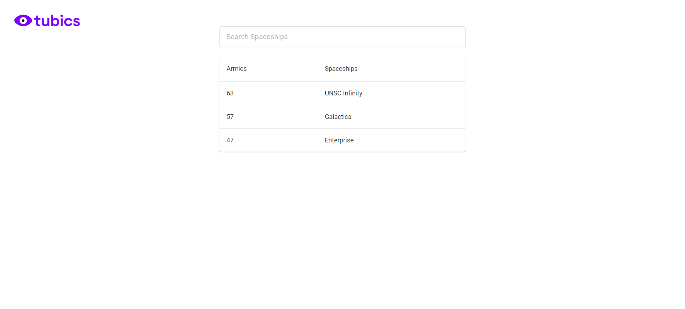

# Tubics Coding Challenge Solution

This repository contains the solution for the Tubics coding challenge. The challenge involves creating random armies of spaceships based on a given number of spaceships.

## Problem Statement

Every player has a planet, and to enable players to attack other player's planets, we need to create armies of randomly distributed spaceships. The task is to generate a random army based on a specified number of spaceships, ensuring that each spaceship type is represented.

## Solution Overview

The solution is implemented using Node.js and React, making use of the Tubics tool-stack. The backend is implemented with Express.js, and the frontend is built with React. The solution ensures non-deterministic results for each call and provides an O(1) algorithm to generate random armies.

## Repository Structure

The repository is structured as follows:

- `client/`: Contains the frontend code built with React.
- `server/`: Contains the backend code implemented with Express.js.
- `client/package.json`: Dependencies and scripts for the client-side application.
- `server/package.json`: Dependencies and scripts for the server-side application.
- `server.js`: Entry point for the server application.
- `README.md`: This file, providing an overview of the solution.

## Getting Started

To run the solution locally, follow these steps:

1. Clone this repository to your local machine.
2. Navigate to the `client/` directory and run `npm install` to install frontend dependencies.
3. Navigate to the `server/` directory and run `npm install` to install backend dependencies.
4. Start the server by running `npm start` in the `server/` directory.
5. Start the client by running `npm start` in the `client/` directory.
6. Access the application in your browser at `http://localhost:3000`.

## Demo

A live demo of the application is available at [Demo URL].

## Additional Notes

- Testing: Unit tests and integration tests can be added to ensure the correctness of the solution.
- Deployment: Deployment scripts and configurations can be added for deploying the solution to production environments.
- Improvements: Further enhancements can be made to improve the scalability and performance of the solution.

## Contact

For any questions or feedback regarding the solution, please contact Muhammad Shiraz at muhammadshiraz996@gmail.com.
